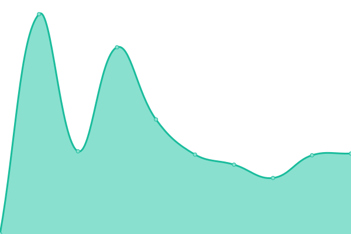
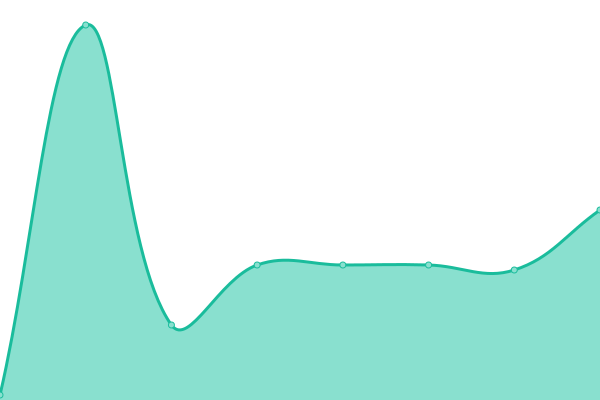

# [📈 Live Status](https://status.biosimulations.org): <!--live status--> **🟩 All systems operational**

This repository contains the open-source uptime monitor and status page for [BioSimulations](https://biosimulations.org), powered by [Upptime](https://github.com/upptime/upptime).

With [Upptime](https://upptime.js.org), you can get your own unlimited and free uptime monitor and status page, powered entirely by a GitHub repository. We use [Issues](https://github.com/biosimulations/status-monitor/issues) as incident reports, [Actions](https://github.com/biosimulations/status-monitor/actions) as uptime monitors, and [Pages](https://status.biosimulations.org) for the status page.

<!--start: status pages-->
<!-- This summary is generated by Upptime (https://github.com/upptime/upptime) -->
<!-- Do not edit this manually, your changes will be overwritten -->
<!-- prettier-ignore -->
| URL | Status | History | Response Time | Uptime |
| --- | ------ | ------- | ------------- | ------ |
|  [Biosimulations API](https://api.biosimulations.org) | 🟩 Up | [biosimulations-api.yml](https://github.com/biosimulations/status-monitor/commits/HEAD/history/biosimulations-api.yml) | 

 346ms
     
 | 

<a href="https://status.biosimulations.org/history/biosimulations-api">100.00%</a>
    

|  [runBioSimulations API](https://run.biosimulations.org) | 🟩 Up | [run-bio-simulations-api.yml](https://github.com/biosimulations/status-monitor/commits/HEAD/history/run-bio-simulations-api.yml) | 

 422ms
     
 | 

<a href="https://status.biosimulations.org/history/run-bio-simulations-api">100.00%</a>
    

|  [BioSimulators API](https://api.biosimulators.org) | 🟩 Up | [bio-simulators-api.yml](https://github.com/biosimulations/status-monitor/commits/HEAD/history/bio-simulators-api.yml) | 

 191ms
     
 | 

<a href="https://status.biosimulations.org/history/bio-simulators-api">100.00%</a>
    

|  [Combine API](https://combine.api.biosimulations.org/kisao/get-similar-algorithms?algorithms=KISAO_0000019) | 🟩 Up | [combine-api.yml](https://github.com/biosimulations/status-monitor/commits/HEAD/history/combine-api.yml) | 

 338ms
     
 | 

<a href="https://status.biosimulations.org/history/combine-api">100.00%</a>
    

|  [Ingress Loadbalancer](34.123.157.17) | 🟩 Up | [ingress-loadbalancer.yml](https://github.com/biosimulations/status-monitor/commits/HEAD/history/ingress-loadbalancer.yml) | 

 36ms
     
 | 

<a href="https://status.biosimulations.org/history/ingress-loadbalancer">100.00%</a>
    

|  [Storage Buckets](155.37.254.142) | 🟩 Up | [storage-buckets.yml](https://github.com/biosimulations/status-monitor/commits/HEAD/history/storage-buckets.yml) | 

 241ms
     
 | 

<a href="https://status.biosimulations.org/history/storage-buckets">100.00%</a>
    

|  [Backend](biosim-submit-ext.cam.uchc.edu) | 🟩 Up | [backend.yml](https://github.com/biosimulations/status-monitor/commits/HEAD/history/backend.yml) | 

 57ms
     
 | 

<a href="https://status.biosimulations.org/history/backend">100.00%</a>
    

<!--end: status pages-->

[**Visit our status website →**](https://status.biosimulations.org)

## 📄 License

- Powered by: [Upptime](https://github.com/upptime/upptime)
- Code: [MIT](./LICENSE) © [BioSimulations](https://biosimulations.org)
- Data in the `./history` directory: [Open Database License](https://opendatacommons.org/licenses/odbl/1-0/)
